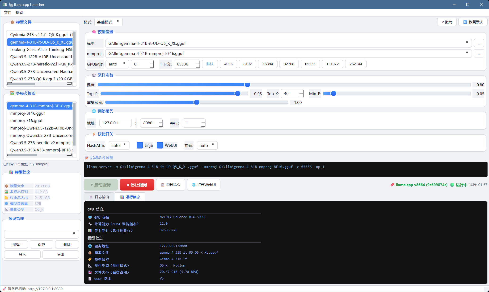

# 🦙 Llama CPP Launcher

> A full-featured GUI launcher for `llama-server` (llama.cpp). Configure, launch, and monitor GGUF models — no command line required.

**[📖 中文文档](README_zh.md)**

---

## 💡 Why Llama CPP Launcher?

Unlike Ollama, LM Studio, and similar tools that **bundle a specific version of llama.cpp**, Llama CPP Launcher uses the `llama-server` binary already on your system. This simple design choice changes everything.

### 🔓 Backend Freedom

| | Llama CPP Launcher | Others |
|---|---|---|
| Upgrade llama.cpp | ✅ Swap the binary, done | ❌ Wait for app update |
| Custom builds | ✅ CUDA, ROCm, Vulkan, Metal, SYCL | ❌ Stuck with bundled version |
| Bleeding-edge commits | ✅ Build today, use today | ❌ Weeks or months of waiting |
| Rollback | ✅ Put the old binary back | ❌ Hope they provide it |

### ⚡ Always Up-to-Date

- **🔍 Dynamic default detection** — Runs `llama-server --help` at startup and parses real defaults from *your* version. No stale hardcoded values.
- **🗂️ Chat template auto-discovery** — New templates appear in the UI automatically, extracted straight from the server binary.
- **🔌 Zero coupling** — Pure frontend. Any llama.cpp version, fork, or build works as long as the CLI is compatible.

### 🪶 Lightweight & Transparent

- **📦 No bundled backend** — ~6000 lines of Python. No hidden binaries, no 500MB downloads.
- **👁️ Full command visibility** — See the complete `llama-server` command build in real-time as you tweak settings.
- **🔒 No telemetry** — Zero data collection. No accounts. No phone home. 100% local.

### 🛠️ Power User Friendly

- **🎛️ 100+ parameters** across 7 organized tabs
- **💾 Preset system** — Save, load, import, export as JSON
- **↩️ Undo support** — Debounced snapshots, step back through changes

---

## 📸 Screenshot



---

## ✨ Features

### 🎭 Two Modes

| Basic Mode | Advanced Mode |
|---|---|
| Sliders for temp, top-p, top-k, min-p, repeat penalty | 7 tabs: Model, Context, Sampling, GPU, Server, Chat/Reasoning, Advanced |
| Quick context size buttons (4K → 262K) | Every `llama-server` CLI parameter exposed |
| GPU layers: auto / all / manual | LoRA adapters, control vectors, grammar, JSON schema |
| Get a model running in seconds | Fine-tune every detail |

### 📂 Model Browser

- 🔎 Background thread scanning for `.gguf` files — no UI freezing
- 🏷️ Auto-categorizes: **models**, **mmprojs** (vision adapters), **LoRAs**
- 📏 Shows file sizes (MB/GB) at a glance
- 🔗 Auto-matches mmproj to model by name heuristic
- 📁 Configurable scan directory with persistent path memory

### 📊 Real-time Log Parsing

Monitors `llama-server` stdout/stderr in real-time and extracts **40+ data points** into a structured summary panel across 9 categories. **Compatible with both old and new llama.cpp log formats** (v9174+ `srv`-prefixed format). No more scrolling through walls of terminal text.

**What it captures:**

| Category | Details |
|---|---|
| 🖥️ **GPU** | Device name, compute capability, total VRAM, per-GPU free memory |
| 📦 **Model** | File name, model name, quant type, file size, GGUF version |
| 🏗️ **Architecture** | Params, arch, layers, embed dim, FFN dim, vocab size/type, tensor precision distribution |
| ⚙️ **Runtime** | Train ctx, runtime ctx, batch, ubatch, sliding window, RoPE freq, slots, thinking mode |
| 💾 **VRAM** | GPU offload layers, model VRAM, CPU buffer, projected VRAM, KV cache, compute buffer, prompt cache |
| ⚡ **Performance** | Flash Attention, KV unified, graph nodes, graph splits |
| 🔧 **System** | CPU name/RAM, thread config, OpenMP, Repack |
| 👁️ **Vision** | Encoder status, mmproj file, vision model size, image resolution, min image tokens |

The info panel **updates live** — GPU offload layers appear during loading, buffer sizes populate during initialization, status flips to "ready" when the server starts listening.

### 💾 Preset Management

- Save/load/delete named presets
- Import/export presets as JSON files for sharing
- Auto-loads last-used preset on startup
- Overwrite confirmation dialog

### 🚀 Server Lifecycle

- ▶️ One-click start/stop with color-coded status indicator (starting/running/stopped/error)
- ⏱️ Real-time runtime counter (MM:SS)
- ⚠️ Port conflict detection before launch with user confirmation
- 🌐 One-click to open llama-server WebUI in browser
- Graceful shutdown with 3s timeout, then force kill
- Auto-stops server on application close

### ↩️ Undo System

- Debounced parameter snapshots (800ms delay)
- Up to 20 history entries
- Step back through recent changes without losing work
- Undo button auto-enables/disables based on history depth

### 📝 Command Preview

- Real-time `llama-server` command line display
- Updates on every parameter change
- One-click copy to clipboard

### 📄 Log Management

- Real-time log output with auto-scroll toggle
- Clear log button
- Export log to text file

### 🧮 Model Info Estimation

- Estimates quantization type from filename patterns (Q4_K_M, IQ4_XS, etc.)
- Estimates parameter count from file size and quant type
- Displays model info panel before launch

### 🌐 Internationalization

- Real-time Chinese/English interface switching — no restart required
- Language preference persisted across sessions
- All UI strings, dialogs, and runtime info labels are translatable

### 🔧 Menu Bar & Shortcuts

- **File** menu: Set scan path (Ctrl+P), refresh models (F5), exit (Alt+F4)
- **Language** menu: Switch between Chinese and English
- **Help** menu: About dialog
- Status bar for action confirmations

---

## 📋 Requirements

- 🐍 Python 3.11+
- 🎨 PyQt6
- 🦙 `llama-server` — Download and install from [ggml-org/llama.cpp](https://github.com/ggml-org/llama.cpp), then add the binary to your system PATH environment variable.

---

## 🚀 Installation

```bash
# Clone the repository
git clone https://github.com/your-username/llama-cpp-launcher.git
cd llama-cpp-launcher

# Create virtual environment and install dependencies
python -m venv venv
venv\Scripts\activate  # Windows
source venv/bin/activate  # Linux/macOS

pip install -r requirements.txt
```

---

## 🖥️ Usage

### Windows
Double-click `run.bat` or run:
```bash
python main.py
```

### Linux/macOS
> ⚠️ Not yet tested on Linux. Users may need to adjust paths and scripts. Contributions welcome!

```bash
python main.py
```

---

## 📁 Project Structure

```
llama-cpp-launcher/
├── main.py                  # Application entry point
├── run.bat                  # Windows launcher script
├── core/
│   ├── config.py            # Configuration & preset management
│   ├── defaults.py          # Default parameter definitions & CLI parsing
│   ├── i18n.py              # Internationalization (Chinese/English)
│   └── runner.py            # llama-server process management
├── ui/
│   ├── main_window.py       # Main application window
│   ├── basic_panel.py       # Basic mode panel
│   ├── advanced_panel.py    # Advanced mode panel (100+ parameters)
│   └── model_browser.py     # GGUF model file browser
└── requirements.txt         # Python dependencies
```

---

## 🆚 Comparison

| Feature | Llama CPP Launcher | Ollama | LM Studio |
|---------|:---:|:---:|:---:|
| Bring your own llama.cpp | ✅ | ❌ | ❌ |
| Use latest llama.cpp same day | ✅ | ❌ | ❌ |
| Custom compiled backends | ✅ | ❌ | ❌ |
| Full CLI parameter access | ✅ | ❌ | Partial |
| Visible command line | ✅ | ❌ | ❌ |
| No telemetry | ✅ | ❌ | ❌ |
| Lightweight (~6000 lines) | ✅ | ❌ | ❌ |
| Preset management | ✅ | ❌ | ❌ |
| Undo support | ✅ | ❌ | ❌ |
| Chinese/English i18n | ✅ | ❌ | ❌ |

---

## 📄 License

[MIT License](LICENSE) — do whatever you want with it.
