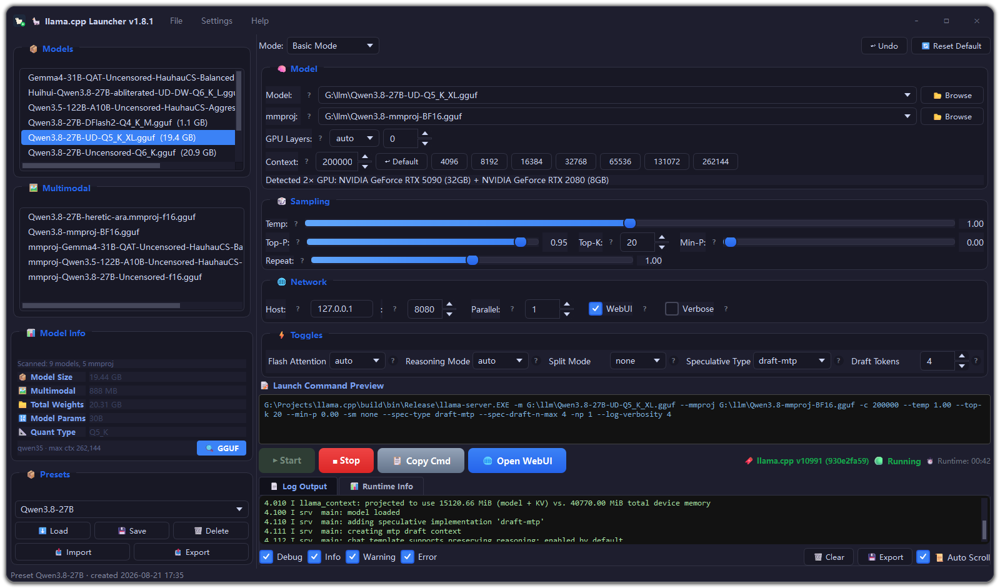

<div align="center">


# 🦙 Llama CPP Launcher

**A full-featured GUI launcher for `llama-server` (llama.cpp) — bring your own binary.**

All **226** `llama-server` CLI parameters in one panel · live default detection · presets · real-time log parsing · built-in GGUF inspector

[](https://github.com/Mars-Albert/llama-cpp-launcher/releases/latest)
[](https://www.python.org/)
[](https://pypi.org/project/PyQt6/)
[](LICENSE)
[-8a2be2)]()

**[Download Latest Release](https://github.com/Mars-Albert/llama-cpp-launcher/releases/latest)** · **[📖 中文文档](README_zh.md)** · [⭐ Star this repo](https://github.com/Mars-Albert/llama-cpp-launcher)

</div>

---

<details>
<summary><b>📑 Table of Contents</b></summary>

- [Why Llama CPP Launcher?](#why)
- [Screenshot](#screenshot)
- [Quick Start](#quick-start)
- [Features](#features)
  - [Two Modes](#two-modes)
  - [Advanced Mode — 9 Tabs](#advanced-tabs)
  - [Model Browser](#model-browser)
  - [Real-time Log Parsing](#log-parsing)
  - [Log Panel](#log-panel)
  - [Presets](#presets)
  - [Per-Parameter Help](#param-help)
  - [GGUF Inspector](#gguf-inspector)
  - [Server Lifecycle](#server-lifecycle)
  - [i18n & Themes](#i18n-themes)
- [Comparison](#comparison)
- [Development](#development)
- [License](#license)

</details>

---

<a id="why"></a>

## 💡 Why Llama CPP Launcher?

Most GUI tools (Ollama, LM Studio, …) **bundle a fixed llama.cpp version** and hide the command line. Llama CPP Launcher is the opposite: it drives the `llama-server` binary *you* installed, and everything it does is visible.

| | Llama CPP Launcher | Bundled-backend tools |
|---|---|---|
| Upgrade llama.cpp | ✅ Swap the binary, done | ❌ Wait for an app update |
| Custom builds (CUDA / ROCm / Vulkan / Metal / SYCL) | ✅ Use any build | ❌ Stuck with the bundled one |
| Bleeding-edge commits | ✅ Build today, run today | ❌ Weeks or months of waiting |
| Rollback | ✅ Put the old binary back | ❌ Hope they ship it |
| The exact command the app runs | ✅ Always visible, one-click copy | ❌ Opaque |

And it stays in sync automatically:

- **🔍 Live default detection** — runs `llama-server --help` on startup and parses the *real* defaults of your binary version. No stale hardcoded values, no drift (drift is surfaced via a ⚠️ indicator).
- **🗂️ Chat template auto-discovery** — templates shipped by your binary appear in the UI automatically.
- **🖥️ GPU detection** — probes `--list-devices` and shows e.g. `2× GPU: RTX 5090 (32GB) + RTX 2080 (8GB)` next to the offload controls (never auto-fills, always your call).

**🪶 Lightweight & private** — ~10,000 lines of Python, one dependency (PyQt6). No bundled backend, no accounts, no telemetry, no phone home. 100% local.

<a id="screenshot"></a>

## 📸 Screenshot

*Basic mode with a model running — runtime info parsed live from server logs.*



<a id="quick-start"></a>

## 🚀 Quick Start

### Option 1: Windows exe (recommended)

1. Download `LlamaCppLauncher.exe` from [Releases](https://github.com/Mars-Albert/llama-cpp-launcher/releases/latest) and double-click to run — no Python needed.
2. Install `llama-server` (e.g. from [ggml-org/llama.cpp releases](https://github.com/ggml-org/llama.cpp/releases)).
3. In the app: **File → Set llama-server path...** and point it at the binary (or just add it to `PATH` — the launcher finds it automatically).
4. Pick a model, hit **Start**, open the WebUI. Done.

> ⚠️ Windows SmartScreen may warn about the unsigned executable — click **More info → Run anyway**.

### Option 2: From source (any OS)

```bash
git clone https://github.com/Mars-Albert/llama-cpp-launcher.git
cd llama-cpp-launcher

python -m venv venv
venv\Scripts\activate   # Windows   ·  source venv/bin/activate  # Linux/macOS
pip install -r requirements.txt

python main.py          # or double-click run.bat on Windows
```

<a id="features"></a>

## ✨ Features

<a id="two-modes"></a>

### 🎭 Two Modes

| Basic Mode | Advanced Mode |
|---|---|
| Model & mmproj pickers backed by the model browser | **226 parameters** in 9 tabs |
| Sliders for temp / top-p / min-p / repeat penalty, top-k spin | LoRA adapters & scales, control vectors, image token limits |
| Context quick-picks: Default → 4K → 262K | Model sources: local file, **HF repo**, **URL**, **Docker repo** |
| GPU layers auto / all / manual, host/port/parallel | Speculative decoding (draft-mtp, ngram, lookup cache) |
| One-line toggles: FlashAttn, reasoning, split mode, spec type | Full server config: SSL, CORS, slots, embedding/rerank, MCP |
| *Get a model running in seconds* | *Fine-tune every detail* |

<a id="advanced-tabs"></a>

### 🎛️ Advanced Mode — 9 Tabs

| Tab | What's inside |
|---|---|
| 🧠 Model | Model file, alias, tags, HF/URL/Docker sources, LoRA, control vectors, mmproj (vision) |
| 📏 Context | Context size, prompt & KV cache, RoPE / YaRN scaling |
| 🎲 Sampling | Temperature, top-k/p, min-p, penalties, grammar & repetition |
| 🎮 GPU/Performance | Offload, memory, CPU threads, affinity, priority |
| ⚡ Speculative | Draft models (draft-mtp), ngram, lookup cache, draft tokens |
| 🌐 Server | Host/port, slots, parallel, endpoints, SSL, CORS, embedding/rerank, router |
| 🤖 Agent/Tools | Tool calling, MCP server, agent settings |
| 💬 Chat/Reasoning | Chat templates, reasoning mode, thinking budget |
| 🔧 Advanced | Text I/O, logging, `extra_args` escape hatch |

<a id="model-browser"></a>

### 📂 Model Browser

- 🔎 Background-thread scan of your model directory — the UI never freezes
- 🏷️ Auto-categorizes `.gguf` files into **Models** / **Multimodal (mmproj)** with sizes
- 📏 Instant model info: size, estimated parameters, quantization type
- 🔗 Auto-matches the mmproj to your model by name
- 📁 Scan directory remembered across sessions; F5 to re-scan

<a id="log-parsing"></a>

### 📊 Real-time Log Parsing

Every line of `llama-server` output is parsed as it arrives (60 patterns, both old and v9174+ `srv`-prefixed formats) and distilled into the **Runtime Info** panel — 40+ data points across 8 categories:

| Category | What you see |
|---|---|
| 🖥️ Hardware | GPU name / compute capability / total & free VRAM per GPU, CPU |
| 📦 Model | File, model name, quant type, GGUF version |
| 🏗️ Architecture | Params, layers, embed/FFN dims, vocab, tensor precision split |
| ⚙️ Runtime | Train vs runtime ctx, batch/ubatch, slots, RoPE freq, thinking mode |
| 💾 VRAM | Offload layers, model/KV-cache/compute buffers, projected usage |
| ⚡ Performance | Flash attention, KV unified, graph nodes & splits |
| 🔧 System | Threads, OpenMP, repack |
| 👁️ Vision | Encoder status, mmproj, image resolution, min image tokens |

The panel fills in *live* — offload layers appear during loading, buffer sizes during init, and the status flips to **ready** the moment the server starts listening.

<a id="log-panel"></a>

### 📄 Log Panel

- 🔍 **Ctrl+F search** with match count and wrap-around
- **Level filter** — Debug / Info / Warn / Error (follows Error by default)
- 📤 Export the visible area or the **full run** (every run is also mirrored to `~/.llama-cpp-launcher/logs/last_run.log`)
- Auto-scroll toggle, clear button, colorized by level

<a id="presets"></a>

### 💾 Presets

- Save / load / delete named presets — only the diff vs. defaults is stored
- Import / export as JSON for sharing; created-time shown in the list
- Choose to **include or exclude machine-local paths** (model/mmproj) when saving
- The preset you last loaded is **restored automatically on next start**
- Param keys renamed/removed across llama.cpp versions are migrated on load

<a id="param-help"></a>

### ❓ Per-Parameter Help

Every parameter row has a **?** button that opens a floating card: the CLI flag, your binary's *live default* (from `--help`), the valid range, and a plain-language explanation. No more memorizing what `--no-kv-offload` does.

<a id="gguf-inspector"></a>

### 🔬 GGUF Inspector

A built-in binary inspector (no weights loaded, pure-stdlib parser):

- **7 tabs**: Overview · Statistics · Metadata · Tensors · Tokenizer · Filename · Diagnostics
- 📊 Visual breakdowns: quantization distribution, layer/module structure, parameter concentration
- 🩺 **Launcher-aware diagnostics**: context exceeds model limit, mmproj name mismatch, draft-mtp without sidecar, chat-template / RoPE / MoE / shard info
- 📤 Export to JSON / CSV / Markdown · background parsing with an in-memory cache

<a id="server-lifecycle"></a>

### 🚀 Server Lifecycle

- ▶️ One-click start/stop with color-coded status + runtime counter (MM:SS)
- ⚠️ Port-conflict check before launch
- 🌐 One-click open of the llama-server WebUI
- Graceful stop (non-blocking, force-kill fallback); auto-stops when you close the app
- ↩️ **Undo** — 800ms-debounced snapshots, up to 20 steps back
- 📝 **Command preview** — the exact `llama-server` command, updated on every change, one-click copy (paths with spaces are quoted correctly)

<a id="i18n-themes"></a>

### 🌐 i18n & Themes

- 🈶/🈷 **Chinese ↔ English live switching** — no restart, preference persisted
- 🌙 **Dark / light theme** — one click in the Help menu, persisted; the log panel and inspector stay theme-aware
- Window geometry, mode, active tab and splitter layout are restored on startup

<a id="comparison"></a>

## 🆚 Comparison

| Feature | Llama CPP Launcher | Ollama | LM Studio |
|---|:---:|:---:|:---:|
| Bring your own llama.cpp binary | ✅ | ❌ | ❌ |
| Run the latest llama.cpp the day it ships | ✅ | ❌ | ❌ |
| Any custom backend (CUDA/ROCm/Vulkan/Metal/SYCL) | ✅ | ❌ | ❌ |
| Full CLI parameter access (226) | ✅ | ❌ | Partial |
| The exact command is visible & copyable | ✅ | ❌ | ❌ |
| Presets with version-aware migration | ✅ | ❌ | ❌ |
| Built-in GGUF inspector | ✅ | ❌ | ❌ |
| No telemetry, 100% local | ✅ | ❌ | ✅ |
| Single lightweight dependency (PyQt6) | ✅ | — | ❌ |

<a id="development"></a>

## 🛠️ Development

- Python 3.11+, PyQt6 (pinned), pytest for tests
- ~10,000 lines; the core schema (`core/params_schema.py`) is the single source of truth for the UI, CLI emission, get/set values, and i18n coverage — adding a parameter is one entry
- `gguf/`, `ui/log_parser.py`, `ui/command_builder.py` are Qt-free and unit-testable headlessly

<details>
<summary><b>Project structure</b></summary>

```
llama-cpp-launcher/
├── main.py                  # Entry point (async startup, logging setup)
├── run.bat                  # Windows launcher (activates venv)
├── build_config.py          # App name / version (CI rewrites on tag)
├── llama_cpp_launcher.spec  # PyInstaller spec (icon embedded)
├── requirements.txt
├── core/
│   ├── params_schema.py     # ★ 226-param schema (Qt-free, single source of truth)
│   ├── params_help.py       # Per-parameter help texts (226 entries)
│   ├── defaults.py          # `--help` parsing, fallback defaults, GPU probe
│   ├── config.py            # Preset & settings IO (~/.llama-cpp-launcher)
│   ├── runner.py            # QProcess wrapper (start/stop/readiness)
│   ├── i18n.py              # zh/en translation (Chinese source language)
│   └── constants.py
├── gguf/                    # Pure-stdlib GGUF binary reader
│   ├── parser.py  models.py  ggml_types.py  filename.py  diagnostics.py
├── ui/
│   ├── main_window.py       # Window orchestration, theme, log panel
│   ├── basic_panel.py       # Basic mode
│   ├── advanced_panel.py    # Advanced mode (schema-driven, 9 tabs)
│   ├── param_help.py        # "?" button + floating help card
│   ├── model_browser.py     # GGUF scanner (background thread)
│   ├── gguf_inspector.py    # 7-tab inspector dialog
│   ├── log_parser.py        # Log line patterns → runtime info (Qt-free)
│   ├── command_builder.py   # Params → `llama-server` argv (Qt-free)
│   └── runtime_info.py      # Runtime info HTML (Qt-free)
├── tests/                   # 17 test modules (headless, in-memory fakes)
└── assets/icon.ico|png
```

</details>

**Releases**: pushing a tag `v*` runs CI on `windows-latest` — tests, then PyInstaller, then the exe is published as a GitHub Release automatically.

<a id="license"></a>

## 📄 License

[MIT](LICENSE) — do whatever you want with it.
