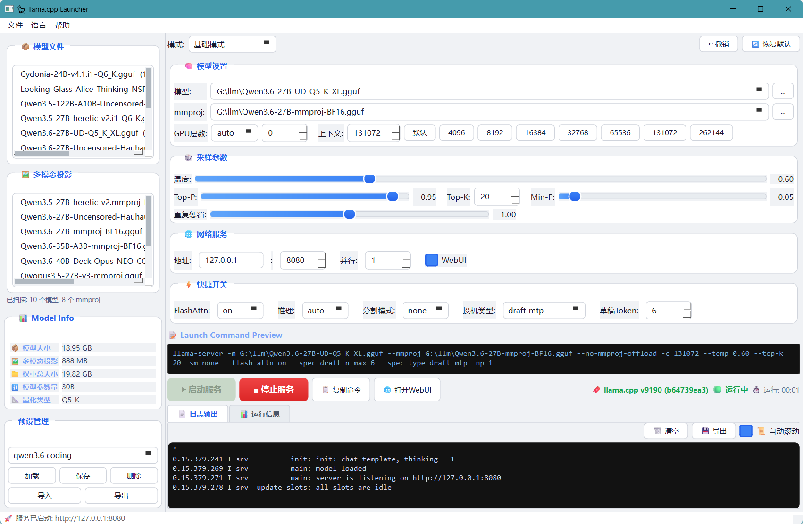

# 🦙 Llama CPP Launcher / Llama 启动器

> 一个功能完整的 `llama-server` (llama.cpp) GUI 启动器。无需命令行即可轻松配置、启动和监控 GGUF 格式的大语言模型。

**[📖 English README](README.md)**

---

## 💡 为什么选择 Llama CPP Launcher？

与 Ollama、LM Studio 等工具**内置绑定特定版本 llama.cpp** 不同，Llama CPP Launcher 直接使用你系统中已安装的 `llama-server` 可执行文件。这个简单的设计理念，带来完全不同的体验。

### 🔓 后端自由

| | Llama CPP Launcher | 其他工具 |
|---|---|---|
| 升级 llama.cpp | ✅ 替换二进制文件即可 | ❌ 等待应用更新 |
| 自定义编译 | ✅ CUDA、ROCm、Vulkan、Metal、SYCL | ❌ 只能用内置版本 |
| 体验最新提交 | ✅ 今天编译，今天使用 | ❌ 等几周甚至几个月 |
| 回退版本 | ✅ 换回旧二进制文件 | ❌ 祈祷他们提供旧版 |

### ⚡ 始终与时俱进

- **🔍 动态默认值检测** — 启动时运行 `llama-server --help`，从*你的*版本中解析真实默认值。不存在过时的硬编码。
- **🗂️ 聊天模板自动发现** — 新模板自动出现在 UI 中，直接从服务端二进制提取。
- **🔌 零耦合设计** — 纯粹的前端。任何 llama.cpp 版本、分支、构建都能用，只要 CLI 兼容。

### 🪶 轻量透明

- **📦 无内置后端** — 约 6000 行 Python 代码。没有隐藏二进制文件，没有 500MB 下载包。
- **👁️ 命令完全可见** — 调整设置时，完整的 `llama-server` 命令行实时构建显示。
- **🔒 无遥测** — 零数据收集。无需注册账号。不联网上报。100% 本地运行。

### 🛠️ 高级用户友好

- **🎛️ 100+ 参数**，7 个标签页分类管理
- **💾 预设系统** — 保存、加载、导入、导出 JSON 格式
- **↩️ 撤销支持** — 防抖快照，随时回退更改

---

## 🆚 与其他工具对比

| 功能 | Llama CPP Launcher | Ollama | LM Studio |
|------|:---:|:---:|:---:|
| 自带 llama.cpp | ✅ | ❌ | ❌ |
| 当天使用最新版 llama.cpp | ✅ | ❌ | ❌ |
| 自定义编译后端 | ✅ | ❌ | ❌ |
| 完整 CLI 参数访问 | ✅ | ❌ | 部分 |
| 命令行可见 | ✅ | ❌ | ❌ |
| 无遥测 | ✅ | ❌ | ❌ |
| 轻量（~6000 行代码） | ✅ | ❌ | ❌ |
| 预设管理 | ✅ | ❌ | ❌ |
| 撤销支持 | ✅ | ❌ | ❌ |

---

## 📸 软件截图



---

## 📥 下载

从 [GitHub Releases](https://github.com/Mars-Albert/llama-cpp-launcher/releases/latest) 下载 `LlamaCppLauncher.exe`，双击即可运行 — 无需安装 Python。

> ⚠️ Windows SmartScreen 可能会警告未签名的可执行文件。点击"更多信息" → "仍要运行"即可。

**前提条件：** `llama-server` 必须已安装并添加到系统 PATH 环境变量。从 [ggml-org/llama.cpp](https://github.com/ggml-org/llama.cpp) 下载。

---

## ✨ 功能详解

### 🎭 双模式设计

| 基础模式 | 高级模式 |
|---|---|
| 温度、Top-P、Min-P、重复惩罚滑块 + Top-K 数值调节 | 7 个标签页：模型、上下文、采样、GPU/性能、服务、聊天/推理、高级 |
| 上下文大小快捷按钮（4K → 262K） | 暴露所有 `llama-server` CLI 参数 |
| GPU 层数：auto / all / 手动 | LoRA 适配器、控制向量、Grammar、JSON Schema |
| 几秒钟让模型跑起来 | 精细调节每一个细节 |

### 📂 模型浏览器

- 🔎 后台线程扫描 `.gguf` 文件，不卡界面
- 🏷️ 自动分类：**模型**、**mmproj**（视觉适配器）、**LoRA**
- 📏 一目了然显示文件大小（MB/GB）
- 🔗 按名称启发式自动匹配 mmproj 到对应模型
- 📁 可配置扫描目录，路径自动记忆

### 📊 实时日志解析

实时监控 `llama-server` 的标准输出和错误流，从日志中提取 **40+ 数据点**，按 8 大分类汇总为结构化信息面板。**兼容新旧 llama.cpp 日志格式**（v9174+ 新增 `srv` 前缀格式）。再也不用在一堆终端输出中翻找关键信息。

**捕获的信息类别：**

| 类别 | 详细信息 |
|---|---|
| 🖥️ **硬件信息** | GPU 设备名称、计算能力、总可用显存、各 GPU 空闲显存、CPU 型号/内存 |
| 📦 **模型** | 文件名、模型名称、量化类型、文件大小、GGUF 版本 |
| 🏗️ **架构** | 参数量、架构类型、层数、嵌入维度、FFN 维度、词表大小/类型、精度分布 |
| ⚙️ **运行参数** | 训练上下文、运行上下文、批处理、物理批处理、滑动窗口、RoPE 频率、槽位数、推理模式 |
| 💾 **显存占用** | GPU 卸载层数、模型显存、CPU 缓冲、预计显存、KV Cache、计算缓冲、Prompt 缓存 |
| ⚡ **性能优化** | Flash Attention、KV 统一、图节点数、图分割数 |
| 🔧 **系统配置** | 线程配置、OpenMP、Repack |
| 👁️ **视觉编码器** | 加载状态、投影文件、视觉模型大小、图像分辨率、最小图像 Token |

信息面板**实时刷新**——GPU 卸载层数在加载过程中逐步显示，缓冲区大小在初始化时填充，服务开始监听的那一刻状态指示器立即切换为"就绪"。

### 💾 预设管理

- 保存/加载/删除命名预设
- 导入/导出预设 JSON 文件，方便分享
- 预设名称安全校验
- 覆盖预设时弹出确认对话框

### 🚀 服务生命周期管理

- ▶️ 一键启动/停止，彩色状态指示器（启动中/运行中/已停止/错误）
- ⏱️ 实时运行计时器（MM:SS）
- ⚠️ 启动前检测端口冲突，用户确认后继续
- 🌐 一键在浏览器中打开 llama-server WebUI
- 优雅关闭，3 秒超时后强制终止
- 关闭应用时自动停止服务

### ↩️ 撤销系统

- 防抖参数快照（800ms 延迟）
- 最多 20 条历史记录
- 回退最近的更改，不丢失工作
- 撤销按钮根据历史深度自动启用/禁用

### 📝 命令预览

- 实时显示完整的 `llama-server` 命令行
- 每次参数变更即时更新
- 一键复制命令到剪贴板

### 📄 日志管理

- 实时日志输出，自动滚动开关
- 清空日志按钮
- 导出日志为文本文件

### 🧮 模型信息估算

- 根据文件名模式估算量化类型（Q4_K、IQ4、Q8_0、F16 等）
- 根据文件大小和量化类型估算参数量
- 启动前即可预览模型规模

### 🌐 国际化

- 中文/英文界面实时切换，无需重启
- 语言偏好跨会话持久保存
- 所有 UI 字符串、对话框和运行信息标签均可翻译

### 🔧 菜单栏与快捷键

- **文件**菜单：设置扫描路径 (Ctrl+P)、刷新模型列表 (F5)、退出 (Alt+F4)
- **语言**菜单：切换中文/英文
- **帮助**菜单：关于对话框
- 状态栏显示操作确认信息

---

## 📋 环境要求

- 🐍 Python 3.11+
- 🎨 PyQt6
- 🦙 `llama-server` — 前往 [ggml-org/llama.cpp](https://github.com/ggml-org/llama.cpp) 下载并安装，然后将二进制路径添加到系统 PATH 环境变量中。

---

## 🚀 安装

```bash
# 克隆仓库
git clone https://github.com/Mars-Albert/llama-cpp-launcher.git
cd llama-cpp-launcher

# 创建虚拟环境并安装依赖
python -m venv venv
venv\Scripts\activate  # Windows
source venv/bin/activate  # Linux/macOS

pip install -r requirements.txt
```

---

## 🖥️ 使用方法

### Windows
双击 `run.bat` 或运行：
```bash
python main.py
```

### Linux/macOS
> ⚠️ Linux 系统尚未经过测试。用户可能需要自行调整路径和脚本。欢迎提交贡献！

```bash
python main.py
```

---

## 📁 项目结构

```
llama-cpp-launcher/
├── main.py                  # 应用程序入口
├── run.bat                  # Windows 启动脚本
├── build_config.py          # 构建配置（名称、版本）
├── llama_cpp_launcher.spec  # PyInstaller 构建配置
├── requirements.txt         # Python 依赖
├── core/
│   ├── config.py            # 配置与预设管理
│   ├── defaults.py          # 默认参数定义与 CLI 解析
│   ├── i18n.py              # 国际化（中文/英文）
│   └── runner.py            # llama-server 进程管理
└── ui/
    ├── main_window.py       # 主窗口
    ├── basic_panel.py       # 基础模式面板
    ├── advanced_panel.py    # 高级模式面板（100+ 参数）
    └── model_browser.py     # GGUF 模型文件浏览器
```

---

## 📄 许可证

[MIT License](LICENSE) — 想怎么用就怎么用。
