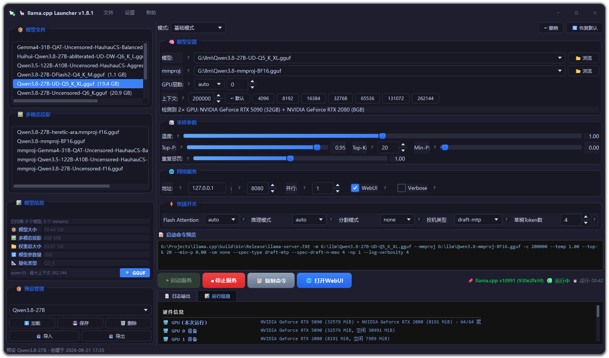

<div align="center">


# 🦙 Llama CPP Launcher / Llama 启动器

**功能完整的 `llama-server` (llama.cpp) GUI 启动器 — 自带你的 llama.cpp 二进制。**

**226** 个 `llama-server` CLI 参数一屏全出 · 动态默认值检测 · 预设管理 · 实时日志解析 · 内置 GGUF 检查器

[](https://github.com/Mars-Albert/llama-cpp-launcher/releases/latest)
[](https://www.python.org/)
[](https://pypi.org/project/PyQt6/)
[](LICENSE)
[-8a2be2)]()

**[⬇️ 下载最新版本](https://github.com/Mars-Albert/llama-cpp-launcher/releases/latest)** · **[📖 English README](README.md)** · [⭐ Star 本项目](https://github.com/Mars-Albert/llama-cpp-launcher)

</div>

---

<details>
<summary><b>📑 目录</b></summary>

- [为什么选择 Llama CPP Launcher？](#why)
- [软件截图](#screenshot)
- [快速开始](#quick-start)
- [功能详解](#features)
  - [双模式设计](#two-modes)
  - [高级模式 — 9 个标签页](#advanced-tabs)
  - [模型浏览器](#model-browser)
  - [实时日志解析](#log-parsing)
  - [日志面板](#log-panel)
  - [预设管理](#presets)
  - [逐参数帮助](#param-help)
  - [GGUF 检查器](#gguf-inspector)
  - [服务生命周期](#server-lifecycle)
  - [国际化与主题](#i18n-themes)
- [与其他工具对比](#comparison)
- [开发](#development)
- [许可证](#license)

</details>

---

<a id="why"></a>

## 💡 为什么选择 Llama CPP Launcher？

大多数 GUI 工具（Ollama、LM Studio 等）**内置固定版本的 llama.cpp**，且命令行对用户不可见。Llama CPP Launcher 走的是另一条路：它驱动的是*你自己*安装的 `llama-server`，一切行为可见可控。

| | Llama CPP Launcher | 内置后端的工具 |
|---|---|---|
| 升级 llama.cpp | ✅ 换个二进制文件，完事 | ❌ 等应用更新 |
| 自定义编译（CUDA / ROCm / Vulkan / Metal / SYCL） | ✅ 任意构建都能用 | ❌ 只能用内置版本 |
| 体验最新提交 | ✅ 今天编译，今天跑 | ❌ 等几周甚至几个月 |
| 回退版本 | ✅ 换回旧二进制文件 | ❌ 祈祷官方提供 |
| 应用实际执行的命令 | ✅ 始终可见，一键复制 | ❌ 黑盒 |

而且它会自动保持同步：

- **🔍 动态默认值检测** — 启动时运行 `llama-server --help`，解析*你的*二进制版本的真实默认值。不存在过时的硬编码，版本漂移还会通过 ⚠️ 指示器提示。
- **🗂️ 聊天模板自动发现** — 你的二进制内置的模板会自动出现在 UI 中。
- **🖥️ GPU 检测** — 通过 `--list-devices` 探测，在卸载层数控制旁显示如 `检测到 2× GPU：RTX 5090 (32GB) + RTX 2080 (8GB)`（只展示，不自动填写，永远由你决定）。

**🪶 轻量且私密** — 约 10,000 行 Python，唯一运行时依赖是 PyQt6。无内置后端、无账号、无遥测、不联网上报，100% 本地运行。

<a id="screenshot"></a>

## 📸 软件截图

*基础模式下模型运行中 — 运行时信息从服务端日志实时解析。*



<a id="quick-start"></a>

## 🚀 快速开始

### 方式一：Windows exe（推荐）

1. 从 [Releases](https://github.com/Mars-Albert/llama-cpp-launcher/releases/latest) 下载 `LlamaCppLauncher.exe`，双击运行 — 无需安装 Python。
2. 安装 `llama-server`（如从 [ggml-org/llama.cpp releases](https://github.com/ggml-org/llama.cpp/releases) 下载）。
3. 在应用中：**文件 → 设置 llama-server 路径…**，指向该二进制文件（或把它加入 `PATH` — 启动器会自动找到）。
4. 选模型，点 **启动**，打开 WebUI。搞定。

> ⚠️ Windows SmartScreen 可能警告未签名的可执行文件 — 点击 **更多信息 → 仍要运行** 即可。

### 方式二：从源码运行（任意系统）

```bash
git clone https://github.com/Mars-Albert/llama-cpp-launcher.git
cd llama-cpp-launcher

python -m venv venv
venv\Scripts\activate   # Windows   ·  source venv/bin/activate  # Linux/macOS
pip install -r requirements.txt

python main.py          # Windows 下也可双击 run.bat
```

<a id="features"></a>

## ✨ 功能详解

<a id="two-modes"></a>

### 🎭 双模式设计

| 基础模式 | 高级模式 |
|---|---|
| 模型 & mmproj 选择器（背后是模型浏览器） | **226 个参数**，9 个标签页 |
| 温度 / Top-P / Min-P / 重复惩罚滑块 + Top-K 数值框 | LoRA 适配器与缩放、控制向量、图像 Token 限制 |
| 上下文快捷按钮：Default → 4K → 262K | 模型来源：本地文件、**HF 仓库**、**URL**、**Docker 仓库** |
| GPU 层数 auto / all / 手动，host/port/并行数 | 投机解码（draft-mtp、ngram、lookup cache） |
| 一行快捷开关：FlashAttn、推理、分割模式、投机类型 | 完整服务端配置：SSL、CORS、slots、embedding/rerank、MCP |
| *几秒钟让模型跑起来* | *精细调节每一个细节* |

<a id="advanced-tabs"></a>

### 🎛️ 高级模式 — 9 个标签页

| 标签页 | 内容 |
|---|---|
| 🧠 模型 | 模型文件、别名、标签、HF/URL/Docker 来源、LoRA、控制向量、mmproj（视觉） |
| 📏 上下文 | 上下文大小、prompt 与 KV 缓存、RoPE / YaRN 缩放 |
| 🎲 采样 | 温度、top-k/p、min-p、惩罚项、语法与重复控制 |
| 🎮 GPU-性能 | 卸载、显存、CPU 线程、亲和性、优先级 |
| ⚡ 投机解码 | 草稿模型（draft-mtp）、ngram、lookup cache、草稿 Token 数 |
| 🌐 服务 | host/port、slots、并行、端点、SSL、CORS、embedding/rerank、router |
| 🤖 Agent/工具 | 工具调用、MCP 服务、agent 设置 |
| 💬 聊天-推理 | 聊天模板、推理模式、thinking budget |
| 🔧 高级 | 文本 I/O、日志、`extra_args` 万能出口 |

<a id="model-browser"></a>

### 📂 模型浏览器

- 🔎 后台线程扫描模型目录 — 界面永不卡顿
- 🏷️ 自动把 `.gguf` 文件分类为 **模型** / **多模态 (mmproj)**，并显示大小
- 📏 即时模型信息：大小、估算参数量、量化类型
- 🔗 按名称自动匹配 mmproj 到对应模型
- 📁 扫描目录跨会话记忆；F5 重新扫描

<a id="log-parsing"></a>

### 📊 实时日志解析

`llama-server` 的每一行输出都会在被打印的同时解析（60 条规则，兼容新旧两种日志格式，含 v9174+ `srv` 前缀格式），提炼进 **运行时信息** 面板 — 8 大类、40+ 数据点：

| 类别 | 你看到的信息 |
|---|---|
| 🖥️ 硬件 | GPU 名称 / 计算能力 / 每卡总显存与空闲显存、CPU |
| 📦 模型 | 文件、模型名、量化类型、GGUF 版本 |
| 🏗️ 架构 | 参数量、层数、embed/FFN 维度、词表、张量精度分布 |
| ⚙️ 运行参数 | 训练 vs 运行上下文、batch/ubatch、slots、RoPE 频率、thinking 模式 |
| 💾 显存 | 卸载层数、模型/KV 缓存/计算缓冲、预计显存占用 |
| ⚡ 性能 | Flash attention、KV 统一、图节点数与分割数 |
| 🔧 系统 | 线程、OpenMP、repack |
| 👁️ 视觉 | 编码器状态、mmproj、图像分辨率、最小图像 Token |

面板**实时刷新** — 卸载层数在加载过程中逐步出现，缓冲大小在初始化时填充，服务端开始监听的那一刻状态立即切换为 **就绪**。

<a id="log-panel"></a>

### 📄 日志面板

- 🔍 **Ctrl+F 搜索**，带匹配计数与循环查找
- **级别过滤** — 调试 / 信息 / 警告 / 错误（默认跟随"错误"级别）
- 📤 导出可见区域或**完整运行日志**（每次运行都会完整镜像到 `~/.llama-cpp-launcher/logs/last_run.log`）
- 自动滚动开关、清空按钮、按级别着色

<a id="presets"></a>

### 💾 预设管理

- 保存 / 加载 / 删除命名预设 — 只存储与默认值的差异
- 以 JSON 文件导入 / 导出，方便分享；列表中显示创建时间
- 保存时可选择**包含或排除本机路径**（model/mmproj）
- 上次加载的预设会在**下次启动时自动恢复**
- 跨 llama.cpp 版本被重命名/删除的参数键会在加载时自动迁移

<a id="param-help"></a>

### ❓ 逐参数帮助

每个参数行都有 **?** 按钮，点开后弹出浮动帮助卡片：CLI 参数名、你二进制版本的*实时默认值*（来自 `--help`）、取值范围，以及通俗的解释。再也不用记 `--no-kv-offload` 是干什么的了。

<a id="gguf-inspector"></a>

### 🔬 GGUF 检查器

内置二进制检查器（不加载权重，纯标准库解析）：

- **7 个标签页**：概览 · 统计 · 元数据 · 张量 · 分词器 · 文件名 · 诊断
- 📊 可视化分析：量化分布、层/模块结构、参数集中度
- 🩺 **启动器感知诊断**：上下文超出模型上限、mmproj 名称不匹配、draft-mtp 缺少 sidecar、聊天模板 / RoPE / MoE / 分片信息
- 📤 导出 JSON / CSV / Markdown · 后台线程解析 + 内存缓存

<a id="server-lifecycle"></a>

### 🚀 服务生命周期

- ▶️ 一键启动/停止，彩色状态指示 + 运行计时器（MM:SS）
- ⚠️ 启动前端口冲突检测
- 🌐 一键在浏览器中打开 llama-server WebUI
- 优雅停止（非阻塞，超时强杀兜底）；关闭应用时自动停止服务
- ↩️ **撤销** — 800ms 防抖快照，最多回退 20 步
- 📝 **命令预览** — 精确的 `llama-server` 命令，每次修改即时更新，一键复制（含空格路径已正确加引号）

<a id="i18n-themes"></a>

### 🌐 国际化与主题

- 🈶/🈷 **中 ↔ 英实时切换** — 无需重启，偏好持久保存
- 🌙 **深色 / 浅色主题** — 帮助菜单一键切换，自动记忆；日志面板与检查器均随主题适配
- 窗口几何、模式、当前标签页与分割栏布局在启动时自动恢复

<a id="comparison"></a>

## 🆚 与其他工具对比

| 功能 | Llama CPP Launcher | Ollama | LM Studio |
|---|:---:|:---:|:---:|
| 自带 llama.cpp 二进制 | ✅ | ❌ | ❌ |
| 当天使用最新 llama.cpp | ✅ | ❌ | ❌ |
| 任意自定义后端（CUDA/ROCm/Vulkan/Metal/SYCL） | ✅ | ❌ | ❌ |
| 完整 CLI 参数访问（226 个） | ✅ | ❌ | 部分 |
| 实际命令可见且可复制 | ✅ | ❌ | ❌ |
| 版本感知的预设迁移 | ✅ | ❌ | ❌ |
| 内置 GGUF 检查器 | ✅ | ❌ | ❌ |
| 无遥测，100% 本地 | ✅ | ❌ | ✅ |
| 单一轻量依赖（PyQt6） | ✅ | — | ❌ |

<a id="development"></a>

## 🛠️ 开发

- Python 3.11+，PyQt6（版本锁定），pytest 测试
- 约 10,000 行；核心 schema（`core/params_schema.py`）是 UI、CLI 命令生成、get/set 值、i18n 覆盖率的唯一事实来源 — 新增一个参数只需一条记录
- `gguf/`、`ui/log_parser.py`、`ui/command_builder.py` 均不依赖 Qt，可无界面单元测试

<details>
<summary><b>项目结构</b></summary>

```
llama-cpp-launcher/
├── main.py                  # 入口（异步启动、日志配置）
├── run.bat                  # Windows 启动脚本（激活 venv）
├── build_config.py          # 应用名 / 版本（CI 按 tag 改写）
├── llama_cpp_launcher.spec  # PyInstaller 构建配置（内嵌图标）
├── requirements.txt
├── core/
│   ├── params_schema.py     # ★ 226 参数 schema（Qt-free，唯一事实来源）
│   ├── params_help.py       # 逐参数帮助文本（226 条）
│   ├── defaults.py          # `--help` 解析、回退默认值、GPU 探测
│   ├── config.py            # 预设与设置 IO（~/.llama-cpp-launcher）
│   ├── runner.py            # QProcess 封装（启动/停止/就绪检测）
│   ├── i18n.py              # 中/英翻译（中文为源语言）
│   └── constants.py
├── gguf/                    # 纯标准库 GGUF 二进制读取器
│   ├── parser.py  models.py  ggml_types.py  filename.py  diagnostics.py
├── ui/
│   ├── main_window.py       # 窗口编排、主题、日志面板
│   ├── basic_panel.py       # 基础模式
│   ├── advanced_panel.py    # 高级模式（schema 驱动，9 标签页）
│   ├── param_help.py        # "?" 按钮 + 浮动帮助卡片
│   ├── model_browser.py     # GGUF 扫描器（后台线程）
│   ├── gguf_inspector.py    # 7 标签页检查器对话框
│   ├── log_parser.py        # 日志行模式 → 运行时信息（Qt-free）
│   ├── command_builder.py   # 参数 → `llama-server` argv（Qt-free）
│   └── runtime_info.py      # 运行时信息 HTML（Qt-free）
├── tests/                   # 17 个测试模块（无界面，内存假数据）
└── assets/icon.ico|png
```

</details>

**发布**：推送 `v*` tag 触发 CI（windows-latest）— 跑测试 → PyInstaller 打包 → 自动发布 exe 到 GitHub Release。

<a id="license"></a>

## 📄 许可证

[MIT](LICENSE) — 想怎么用就怎么用。
